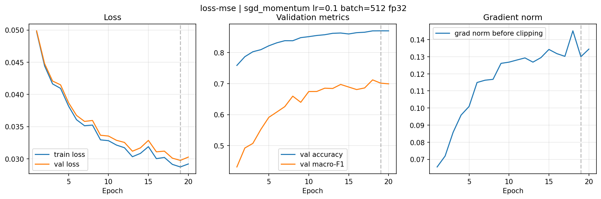
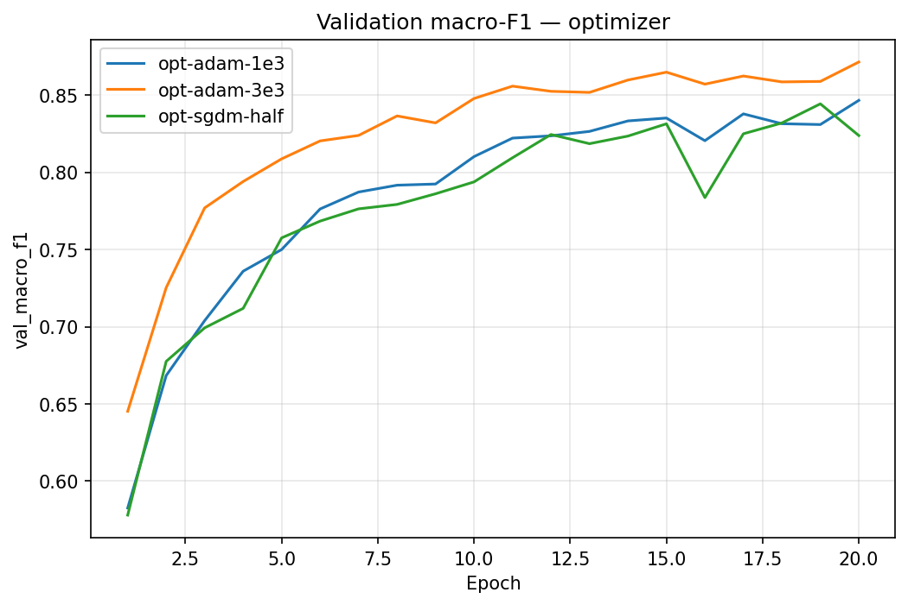

# Báo cáo Lab Day 1 — Nguyễn Minh Hiển — 2A202602759

## 1. Thiết lập

- **Môi trường:** Google Colab, GPU Tesla T4, PyTorch `2.11.0+cu130`.
- **Dữ liệu:** Forest CoverType; `split_metadata.csv` cố định 464 809 mẫu train và 116 203 mẫu eval. Tách 20% train làm validation có phân tầng, seed 42: 371 847 train và 92 962 val. Chỉ 10 đặc trưng số được chuẩn hóa bằng thống kê của train sau khi tách.
- **Model:** `M-base` 54→256→128→7, 47 879 tham số. Baseline dùng cross-entropy (CE), SGD momentum 0,9, `lr=0.1`, batch 512, 20 epoch, khởi tạo He ở lớp ẩn và He×0,1 ở lớp logit, FP32. Cùng split và seed 1 khi đối chiếu từng thay đổi. Metric của mỗi lần chạy lấy ở epoch có **val loss thấp nhất**.
- **Mốc tham chiếu:** accuracy của dự đoán lớp đa số trên val = 0,4876.
- **Chủ đề đã thử:** loss, optimizer, hyper-parameter (độ rộng), dropout, gradient clipping, mixed precision FP16, khởi tạo tham số.

## 2. Kiểm tra ban đầu và độ nhiễu

| Kiểm tra | Kết quả |
|---|---|
| Số tham số / shape logits | 47 879 / `(8, 7)` với batch kiểm tra 8 mẫu |
| Loss bước 0 (so với ln 7 = 1,9459) | 1,9655; lệch 0,0196 |
| Quá khớp 20 mẫu | loss cuối `9,12×10⁻⁷`, accuracy 1,0000 |
| Mọi tham số có gradient khác 0 | Có |
| Baseline, số seed đã chạy | 2: `base-s1`, `base-s2` |
| Baseline val accuracy (TB ± σ) | 0,9099 ± 0,0017 |
| Baseline val macro-F1 (TB ± σ) | 0,8531 ± 0,0122 |

**Ngưỡng nhiễu dùng trong báo cáo:** 2σ = 0,0245 trên val macro-F1. Hai seed là quá ít để ước lượng nhiễu ổn định; các kết luận có chênh lệch nhỏ hơn ngưỡng này chỉ là quan sát trong lần chạy. [Ảnh kiểm tra quá khớp 20 mẫu](figures/compare_health_overfit20.png).

## 3. Kết quả theo chủ đề

Các số val dưới đây lấy từ dòng `exp_id` tương ứng trong sheet `Experiments`. `base-s1` có val macro-F1 0,8445 ở best epoch 18. Chênh lệch nêu dưới đây so với `base-s1`; ảnh của từng thí nghiệm chứa train/val loss, val accuracy và grad norm.

### 3.1 Hàm mất mát — CE vs MSE

- **Dự đoán:** MSE trên nhãn one-hot có thể cho macro-F1 thấp hơn CE vì tín hiệu gradient cho phân loại khác nhau.
- **Kết quả:** `loss-mse` đạt val macro-F1 0,7013 ở epoch 19; `base-s1` dùng CE đạt 0,8445. Chênh lệch −0,1432 vượt 2σ. [Ảnh MSE](figures/loss-mse.png) và [ảnh CE baseline](figures/base-s1.png).
- **Giải thích:** CE tối ưu trực tiếp xác suất lớp đúng; với MSE, gradient qua softmax có thể nhỏ khi đầu ra đã bão hòa. Hai loss khác thang đo nên so macro-F1, không so giá trị loss 0,0303 của MSE với loss 0,2428 của CE.



### 3.2 Bộ tối ưu hóa

- **Dự đoán:** Adam có thể hội tụ nhanh hơn SGD momentum nếu chọn LR phù hợp; giảm LR của SGD có thể học chậm hơn trong 20 epoch.

| Optimizer / `exp_id` | LR | Best epoch | Val macro-F1 |
|---|---:|---:|---:|
| SGD momentum / `base-s1` | 0,1 | 18 | 0,8445 |
| SGD momentum / `opt-sgdm-half` | 0,05 | 19 | 0,8443 |
| Adam / `opt-adam-1e3` | 0,001 | 20 | 0,8465 |
| Adam / `opt-adam-3e3` | 0,003 | 20 | **0,8714** |

- **Đối chiếu:** Adam ở LR tốt nhất đã thử (`opt-adam-3e3`) cao hơn SGD ở LR tốt nhất đã thử (`base-s1`) 0,0269, nhỉnh hơn 2σ = 0,0245. Tuy nhiên Adam mới có một seed, nên chưa đủ để khẳng định ưu thế ổn định. Đổi LR Adam 0,001→0,003 làm F1 tăng 0,0248; đổi LR SGD 0,05→0,1 chỉ tăng 0,0002. Trong các mức đã thử, kết quả Adam nhạy LR hơn, nhưng F1 cuối không tự chứng minh đường học dao động. Ở LR 0,001, Adam hơn `base-s1` chỉ 0,0021, dưới nhiễu. [Ảnh chồng optimizer](figures/compare_optimizer.png); ảnh riêng: [`opt-adam-1e3`](figures/opt-adam-1e3.png), [`opt-adam-3e3`](figures/opt-adam-3e3.png), [`opt-sgdm-half`](figures/opt-sgdm-half.png).
- **Giải thích:** Adam điều chỉnh bước theo moment của từng tham số, nên thang LR phù hợp khác SGD momentum. Dữ liệu này cho thấy kết luận phụ thuộc LR; chưa đủ bằng chứng để nói Adam nói chung luôn tốt hơn.



### 3.3 Hyper-parameter — độ rộng mạng

- **Dự đoán:** Tăng độ rộng có thể cải thiện F1 nhưng tốn thêm bộ nhớ và thời gian.
- **Kết quả:** `wide` đổi lớp ẩn thành 512→256, giữ batch 512, 20 epoch và LR 0,1; val macro-F1 0,8614 so với `base-s1` 0,8445 (Δ +0,0169, **dưới 2σ**). Thời gian/epoch 1,4112 so với 1,3611 giây, đỉnh bộ nhớ 178,46 so với 162,05 MB. Cùng kích thước dữ liệu và batch nên số bước cập nhật mỗi epoch không đổi. [Ảnh `wide`](figures/wide.png) và [ảnh baseline](figures/base-s1.png).
- **Giải thích:** Nhiều tham số tăng khả năng biểu diễn và chi phí tính toán; mức tăng F1 trong một seed chưa vượt nhiễu baseline.

### 3.4 Dropout

- **Dự đoán:** Dropout 0,2 có thể giúp nếu baseline quá khớp rõ; nếu chưa, nó có thể làm học khó hơn.
- **Kết quả:** `dropout-02` đạt val macro-F1 0,8257, thấp hơn `base-s1` 0,0188 (**dưới 2σ**). Ở epoch 20, khoảng cách val loss − train loss giảm từ 0,0222 (`base-s1`) xuống 0,0080 (`dropout-02`), nhưng cả train loss và val loss đều cao hơn (0,2687/0,2767 so với 0,2205/0,2428). [Ảnh dropout](figures/dropout-02.png) và [ảnh baseline](figures/base-s1.png).
- **Giải thích:** Dropout làm giảm phụ thuộc giữa các nơ-ron nhưng cũng giảm năng lực khớp train ở cấu hình này. Gap nhỏ hơn đi cùng loss cao hơn chưa chứng minh khả năng tổng quát tốt hơn; một seed không đủ kết luận dropout có hại nói chung.

### 3.5 Gradient clipping

- **Dự đoán:** Ngưỡng 1,0 có thể ít tác dụng nếu chuẩn gradient thường nhỏ.
- **Kết quả:** `clip-1` đạt val macro-F1 0,8513, hơn `base-s1` 0,0069 (**dưới 2σ**). Giá trị `grad_norm` được ghi **trước clip**; trung bình theo epoch cao nhất khoảng 0,5907 trong `clip-1`. [Ảnh clipping](figures/clip-1.png) và [ảnh baseline](figures/base-s1.png).
- **Giải thích:** Clip chỉ thay đổi cập nhật khi chuẩn gradient của **một bước** vượt 1,0. Log hiện tại chỉ có giá trị tổng hợp theo epoch, không có số bước bị clip, nên chưa xác nhận clip có kích hoạt hay không. Chưa thử cặp LR cao có/không clip; không thể kết luận nó có cứu được huấn luyện tại LR cao.

### 3.6 Mixed precision

- **Dự đoán:** FP16 có thể giảm thời gian/bộ nhớ, nhưng overhead có thể lấn át lợi ích với MLP nhỏ.

| `exp_id` | Precision | Val macro-F1 | Giây/epoch | Đỉnh bộ nhớ GPU (MB) |
|---|---|---:|---:|---:|
| `base-s1` | FP32 | 0,8445 | 1,3611 | 162,0488 |
| `amp-fp16` | FP16 | 0,8124 | 1,8476 | 162,0498 |

- **Đối chiếu:** FP16 chậm hơn 0,4865 giây/epoch và thấp hơn 0,0320 macro-F1 (vượt 2σ trong lần chạy này); đỉnh bộ nhớ gần như bằng FP32. [Ảnh FP16](figures/amp-fp16.png) và [ảnh FP32](figures/base-s1.png). BF16 chưa được chạy/đo, nên không suy ra tốc độ hay độ chính xác BF16.
- **Giải thích:** Với mạng nhỏ, chi phí autocast/GradScaler và kernel có thể vượt lợi ích tính toán FP16. Một seed và một lần đo thời gian chưa đủ kết luận hiệu năng tổng quát trên T4.

### 3.7 Khởi tạo tham số

- **Dự đoán:** He giữ độ lớn kích hoạt qua ReLU tốt hơn khởi tạo quá nhỏ; Xavier có thể đổi tốc độ học. `zeros` gây đối xứng giữa các nơ-ron.
- **Kiểm tra bước 0:** Độ lệch chuẩn sau từng Linear/ReLU trên cùng 512 mẫu val; `zeros` và `normal` **chỉ kiểm tra bước 0, chưa huấn luyện**.

| Init | Loss bước 0 | Std kích hoạt theo lớp |
|---|---:|---|
| He | 1,9655 | 0,666; 0,395; 0,646; 0,370; 0,059 |
| Xavier | 2,0222 | 0,278; 0,165; 0,220; 0,126; 0,197 |
| normal nhỏ | 1,9460 | 0,035; 0,021; 0,004; 0,002; 0,000 |
| zeros | 1,9459 | 0; 0; 0; 0; 0 |

- **Kết quả huấn luyện:** `init-xavier` đạt val macro-F1 0,8514 so với He `base-s1` 0,8445 (Δ +0,0070, **dưới 2σ**). [Ảnh Xavier](figures/init-xavier.png) và [ảnh He](figures/base-s1.png).
- **Giải thích:** He dùng phương sai 2/fan-in cho ReLU; Xavier phân bổ theo fan-in và fan-out. Khởi tạo `normal` quá nhỏ làm kích hoạt co dần. `zeros` cho các nơ-ron cùng lớp cùng đầu ra và gradient, nên không phá được đối xứng; loss gần ln 7 ở bước 0 không chứng minh mô hình sẽ học được.

## 4. Đánh giá cuối trên tập eval

Chỉ sau khi xem val, chọn `opt-adam-3e3`: M-base, CE, Adam `lr=0.003`, batch 512, 20 epoch, He, FP32, seed 1. Nó có val macro-F1 cao nhất trong các cấu hình đã thử; metric của từng cấu hình lấy ở best epoch theo val loss. Không dùng eval để chỉnh cấu hình. Số eval dưới đây lấy từ `eval_result.json` của cấu hình cuối và `results/baseline_eval_result.json` của baseline.

| Cấu hình | Seed nộp | Val macro-F1 | **Eval macro-F1** | Eval accuracy |
|---|---:|---:|---:|---:|
| Baseline `base-s1` | 1 | 0,8445 | 0,8475 | 0,9062 |
| Cuối `opt-adam-3e3` | 1 | 0,8714 | **0,8713** | 0,9100 |

Trên val, Δ = +0,0269, vừa vượt 2σ = 0,0245; trên eval, Δ = +0,0238. **Không thể dùng ngưỡng nhiễu val để kết luận về nhiễu eval** vì chưa chạy nhiều seed của cấu hình cuối trên eval. Val và eval của cấu hình cuối gần nhau (0,8714 và 0,8713); baseline cũng gần nhau (0,8445 và 0,8475).

### 4.1 Phân tích lỗi theo lớp

| Lớp | Support | Precision | Recall | F1 |
|---:|---:|---:|---:|---:|
| 0 | 42 368 | 0,9229 | 0,8834 | 0,9027 |
| 1 | 56 661 | 0,9084 | 0,9383 | 0,9231 |
| 2 | 7 151 | 0,9006 | 0,9271 | 0,9137 |
| 3 | 549 | 0,8928 | 0,7432 | 0,8111 |
| 4 | 1 899 | 0,7624 | 0,8194 | 0,7898 |
| 5 | 3 473 | 0,8750 | 0,7941 | 0,8326 |
| 6 | 4 102 | 0,9253 | 0,9266 | 0,9259 |

Lớp 4 khó nhất (F1 0,7898; 1 899 mẫu), trong đó 301 mẫu bị nhầm sang lớp 1 theo hàng lớp 4 của ma trận nhầm lẫn. Ít mẫu hơn lớp 1 và đặc trưng có thể chồng lấn là **giả thuyết**, chưa được kiểm chứng trực tiếp. Bước tiếp theo hợp lý là xem các mẫu 4→1 và thử trọng số lớp trên train, chọn bằng val.

Ma trận nhầm lẫn (hàng: nhãn thật; cột: dự đoán), từ `eval_result.json`:

```text
 37427   4598      3      0     63      6    271
  2846  53167    130      0    384     98     36
     0    211   6630     32     32    246      0
     0      0    105    408      0     36      0
    18    301     16      0   1556      8      0
     8    207    478     17      5   2758      0
   255     45      0      0      1      0   3801
```

## 5. Trả lời các câu hỏi dẫn dắt

1. **Optimizer nào thắng khi chỉnh LR công bằng?** Trong các LR đã thử, Adam 0,003 (`opt-adam-3e3`) đạt 0,8714, SGD momentum 0,1 (`base-s1`) đạt 0,8445; Δ = 0,0269, nhỉnh hơn 2σ. Nếu nhìn Adam 0,001 (`opt-adam-1e3`) thì chỉ đạt 0,8465, hơn SGD 0,0021, chưa vượt nhiễu. Vì thế kết luận phụ thuộc việc chỉnh LR; cần thêm seed Adam để chắc hơn. Xem [ảnh optimizer](figures/compare_optimizer.png).
2. **Dropout có giúp khi chưa quá khớp?** `dropout-02` làm gap cuối epoch nhỏ hơn nhưng train/val loss đều cao hơn và val F1 thấp hơn 0,0188 (dưới 2σ). Nó có thể hữu ích khi gap lớn và val xấu đi trong lúc train tiếp tục tốt lên; dấu hiệu đó chưa rõ trong baseline này. Xem [ảnh dropout](figures/dropout-02.png).
3. **Clipping giải quyết gì; đã chứng minh chưa?** Nó giới hạn norm gradient từng bước để ngăn bước cập nhật quá lớn. `clip-1` hơn baseline 0,0069, dưới nhiễu; `grad_norm` đang là thống kê theo epoch, không ghi số bước chạm ngưỡng. Do đó thí nghiệm này **chưa chứng minh** clipping đã kích hoạt hay cứu được LR cao. Xem [ảnh clipping](figures/clip-1.png).
4. **FP16 có nhanh hơn không?** Không trong lần đo T4 này: `amp-fp16` 1,8476 giây/epoch so với FP32 `base-s1` 1,3611; bộ nhớ đỉnh gần bằng nhau. MLP nhỏ có thể bị overhead autocast/GradScaler chi phối. Xem [ảnh FP16](figures/amp-fp16.png).
5. **Vì sao zeros hỏng; He khác Xavier?** `zeros` tạo nơ-ron đối xứng, cùng đầu ra/gradient và kích hoạt 0; He đặt phương sai 2/fan-in để duy trì tín hiệu qua ReLU, Xavier dùng cả fan-in/fan-out. Số đo bước 0 ở mục 3.7 cho thấy `normal` nhỏ làm kích hoạt co dần; chênh val F1 He/Xavier 0,0070 dưới nhiễu nên chưa kết luận cách nào thắng ở mạng này.
6. **Loss không giảm sau 2 000 bước: ba kiểm tra đầu tiên?** (i) In phân bố đầu vào, logits và loss bước 0 so với ln 7 để tìm chuẩn hóa/nhãn/thang khởi tạo sai (bài này 1,9655). (ii) Thử quá khớp 20 mẫu để cô lập lỗi dữ liệu, loss, optimizer hoặc vòng lặp (bài này đạt accuracy 1,0). (iii) Kiểm tra gradient từng tham số và norm từng bước, LR và cập nhật trọng số để phát hiện gradient 0/nổ hoặc bước quá nhỏ; bài này tất cả tham số có gradient khác 0.

## 6. Hạn chế và điều bất ngờ

- **Khác dự đoán:** `amp-fp16` không nhanh và không tiết kiệm bộ nhớ đỉnh rõ rệt so với `base-s1`; chênh val F1 −0,0320. Overhead trên MLP nhỏ là giải thích khả dĩ, chưa được tách đo riêng. `wide` cao hơn baseline 0,0169 nhưng dưới nhiễu, nên chưa chứng minh tăng độ rộng có lợi.
- **Giới hạn thiết kế:** Chỉ hai seed baseline khiến 2σ không ổn định; các biến thể chỉ có một seed. LR chỉ dò vài giá trị/5 epoch trước khi chạy 20 epoch; lựa chọn LR có thể đổi khi dò kỹ hơn. Không có đếm số bước bị clip hay cặp LR cao có/không clip. Chưa chạy BF16, chưa đo nhiễu eval nhiều seed. Các nhận định cơ chế là giả thuyết phù hợp số đo, chưa phải bằng chứng nhân quả.
- **Nếu có thêm thời gian:** lặp `opt-adam-3e3` và FP16 nhiều seed/lần đo, ghi norm từng bước và số bước bị clip, thử clipping ở LR cao; sau đó chọn lại bằng val trước khi đánh giá eval.

## 7. Phụ lục

- **File nộp:** `REPORT.md`, `experiments.xlsx`, `predictions_eval.csv`, `eval_result.json`, `code/` (gồm `lab.ipynb`), `figures/`, `results/`.
- **Thời gian chạy ước tính:** tổng thời gian huấn luyện 11 thí nghiệm × 20 epoch ≈ 320 giây (5,3 phút) theo `time_per_epoch_s` trong bảng; chưa gồm tải/chuẩn bị dữ liệu, kiểm tra ban đầu, eval và lưu ảnh.
